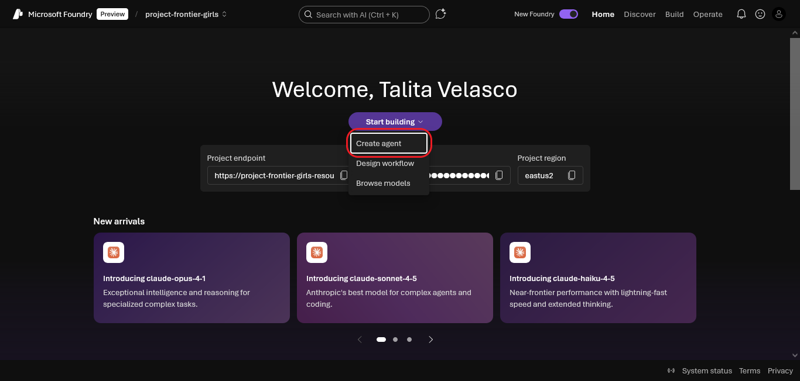

# 🛠️ Como o agente foi criado

Este documento apresenta o processo de criação do agente bibliotecário digital dentro da plataforma Microsoft Foundry.

---

## 🧭 Etapas de criação

### 1. Acesso à plataforma
O projeto foi iniciado no ambiente Microsoft Foundry, dentro do espaço `project-frontier-girls`.

---

### 2. Criação do agente
O agente foi criado com o nome `afg-bibliotecario`, que serviu como identificador interno.

---

### 3. Escolha do modelo
Foi selecionado o modelo `gpt-4-1`, por sua capacidade de gerar respostas contextualizadas e bem estruturadas.

---

### 4. Ativação de ferramentas
A ferramenta `File search` foi ativada para permitir que o agente consultasse diretamente os arquivos anexados.

---

### 5. Anexação da base de dados
Foram anexados arquivos contendo 200 obras literárias, incluindo versões refinadas da base original.

---

### 6. Playground e testes iniciais
O agente foi testado no Playground da plataforma, com variações de instruções e diferentes estilos de resposta.

---

## 📄 Documentação complementar

Para detalhes específicos de cada etapa, consulte:

- ⚙️ [Configuração do agente](configuracao.md)  
- 🧪 [Testes realizados](testes.md)  
- 📸 [Resultados finais](resultados.md)

---

## ✅ Conclusão

A criação do agente envolveu decisões técnicas e editoriais para garantir que ele fosse útil, acessível e alinhado com os objetivos educacionais do projeto.

