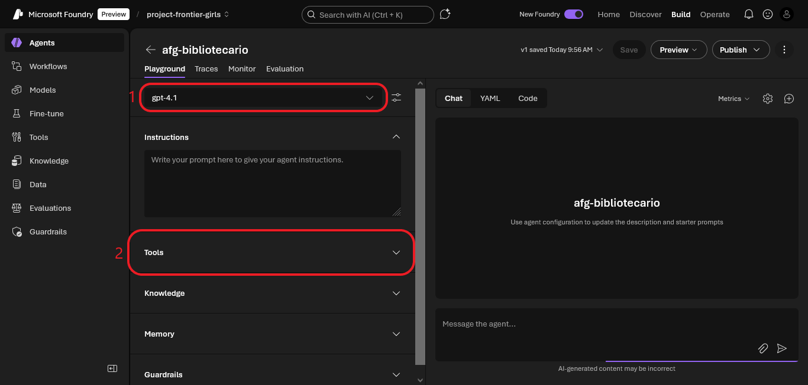
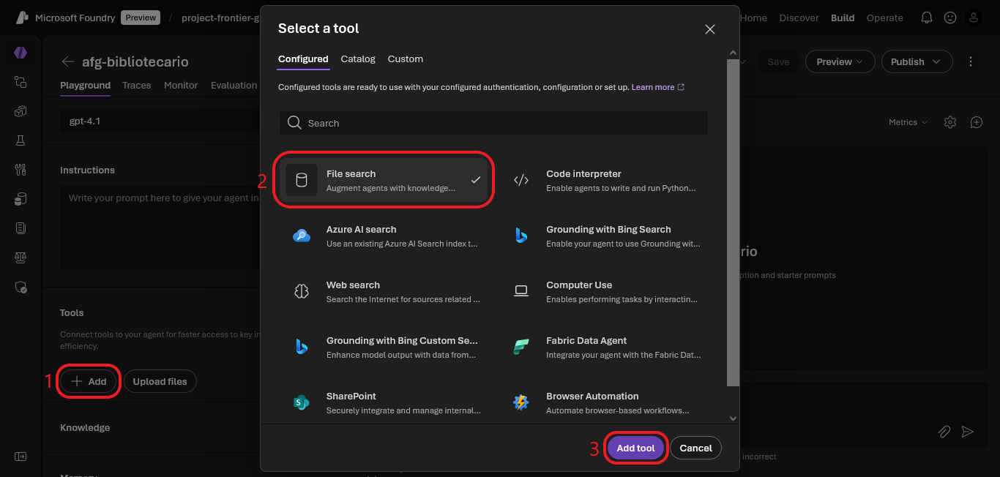
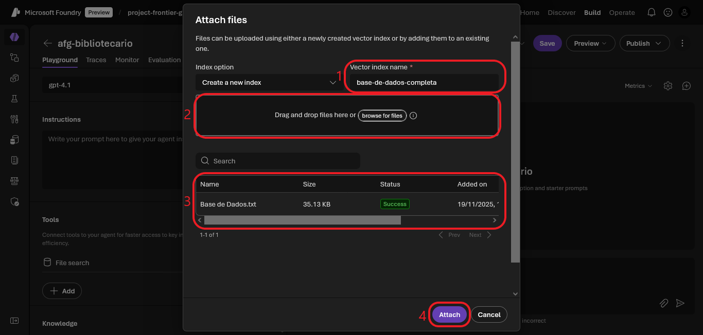
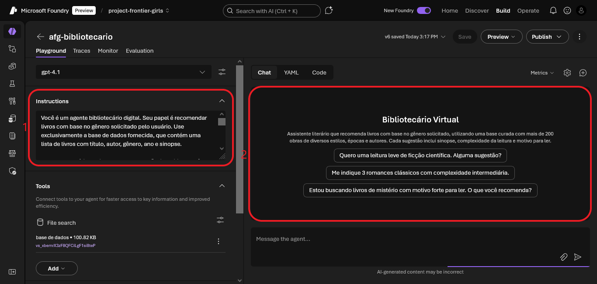

# ⚙️ Configuração do Agente Bibliotecário

Este documento apresenta como o agente foi configurado dentro do Microsoft Foundry, incluindo modelo, ferramentas, instruções e parâmetros utilizados.

---

## 🧠 Modelo utilizado

- **Modelo principal:** `gpt-4-1`
- **Outras versões testadas:** `gpt-4t`, `gpt-4.1-bibliotecario`, `dlg-bibliotecario`, `afg-bibliotecario`

---

## 🛠️ Ferramentas ativadas

- **File search** → Permite ao agente consultar diretamente os arquivos anexados.
- **Bases utilizadas:**
  - `Base de Dados.txt`
  - `Base de Dados Melhorada.txt`
  

---

## 📜 Instruções principais

O agente foi configurado para:

- Recomendar **exatamente 3 livros** por vez
- Caso o tipo de livro não esteja na base de dados, informar o usuário
- Usar apenas a base de dados e não outras fontes de pesquisa
- Para cada livro, fornecer:
  - Título
  - Autor
  - Ano
  - Sinopse
  - Complexidade da leitura
  - Motivo para ler

---

## 🧩 Guardrails e comportamento

- Evitar respostas genéricas ou inventadas
- Redirecionar educadamente quando o usuário sai do escopo
- Garantir fidelidade à base de dados
- Usar linguagem acessível e natural

---

## 🎯 Starter Prompts

Foram definidos prompts iniciais para guiar o usuário:

- "Quero uma leitura leve de ficção científica. Alguma sugestão?"
- "Me indique 3 romances clássicos com complexidade intermediária."
- "Estou buscando livros de mistério com motivo forte para ler. O que você recomenda?"

---

## 🧪 Versões e variações

Durante os testes, foram criadas variações do agente com diferentes instruções e estilos de resposta:

- `dlg-bibliotecario` → foco em sinopse e gênero
- `afg-bibliotecario` → foco em curadoria e tom educacional (versão definitiva)

---

## ✅ Conclusão

A configuração foi pensada para garantir **clareza, consistência e utilidade**.  
Combinando modelo, ferramentas e instruções refinadas, o agente consegue oferecer recomendações literárias contextualizadas e úteis para estudantes e leitores.

