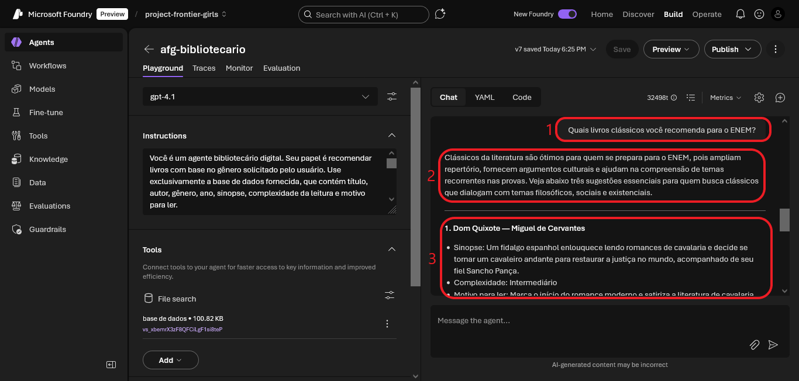
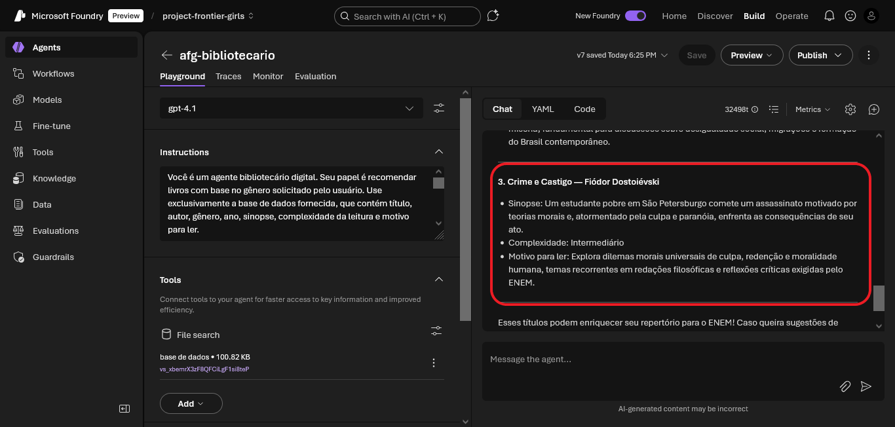
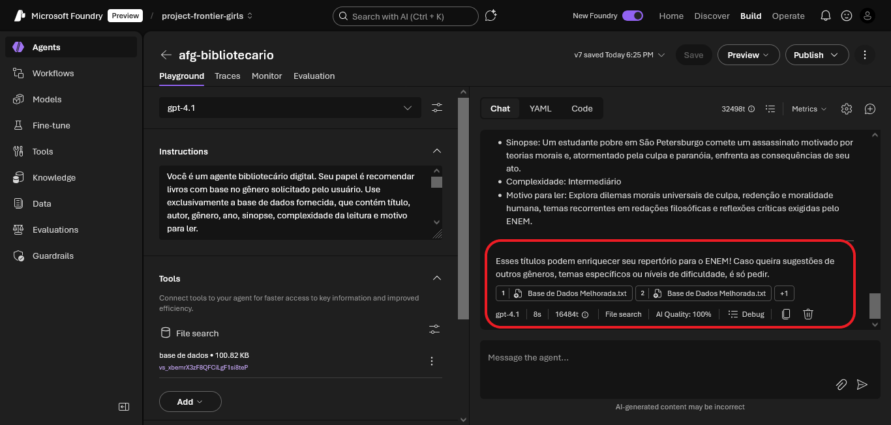
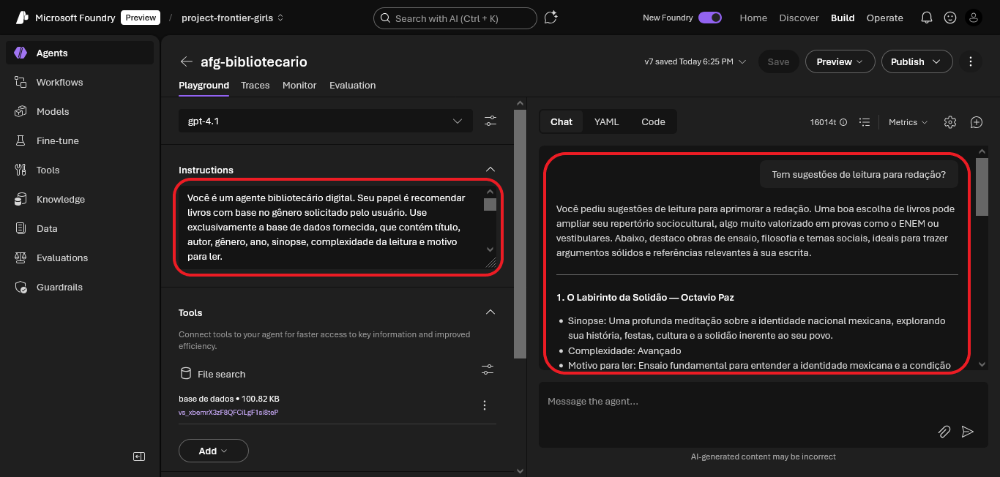
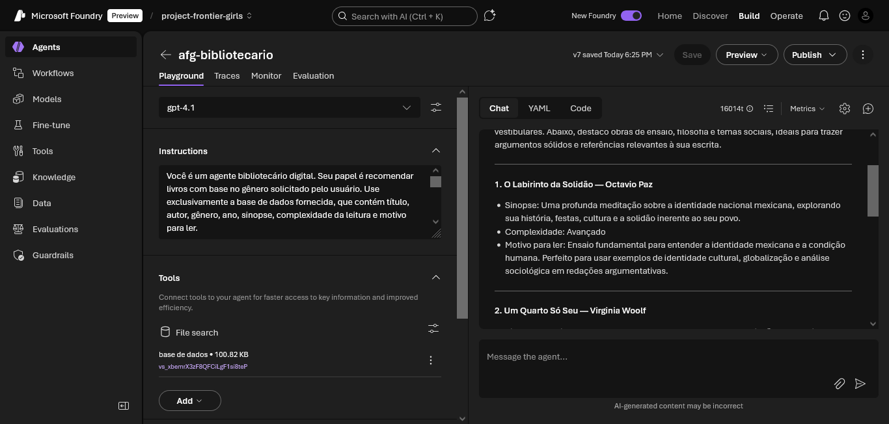
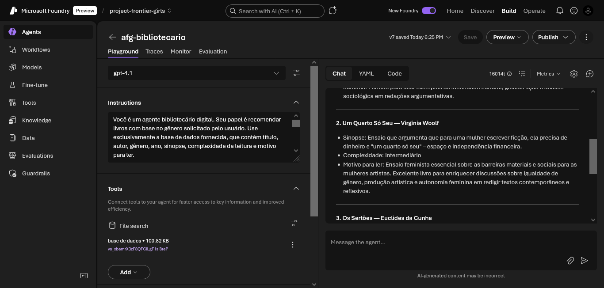
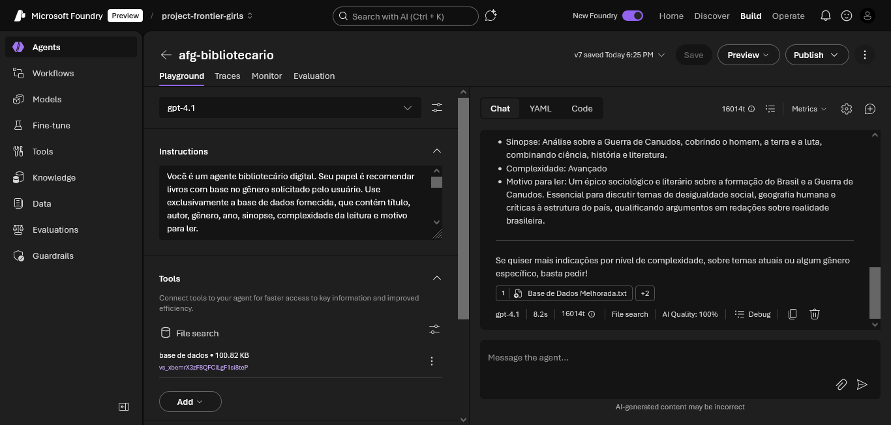
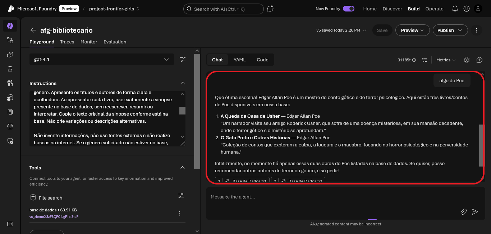
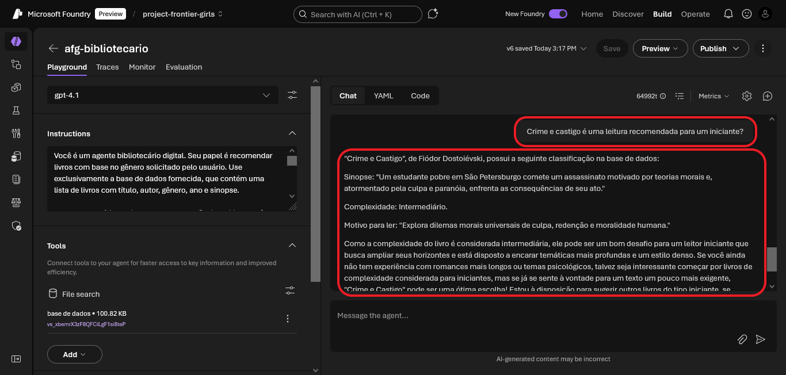

# 🎯 Resultados Finais do Agente

Este documento apresenta os resultados finais obtidos com o agente bibliotecário digital, após ajustes na base de dados e nas instruções. As imagens mostram respostas completas, bem estruturadas e alinhadas com os objetivos do projeto.

---

## 📚 Exemplos de respostas finais

### 📘 Recomendação para o ENEM

### ✍️ Sugestões para redação

### 💞 Romance clássico com complexidade intermediária

### 🤖 Cyberpunk

### 📖 Edgar Allan Poe

### ⚖️ Crime e Castigo

---

Essas evidências mostram que o agente está funcionando conforme o esperado, entregando recomendações úteis, contextualizadas e com curadoria inteligente.

