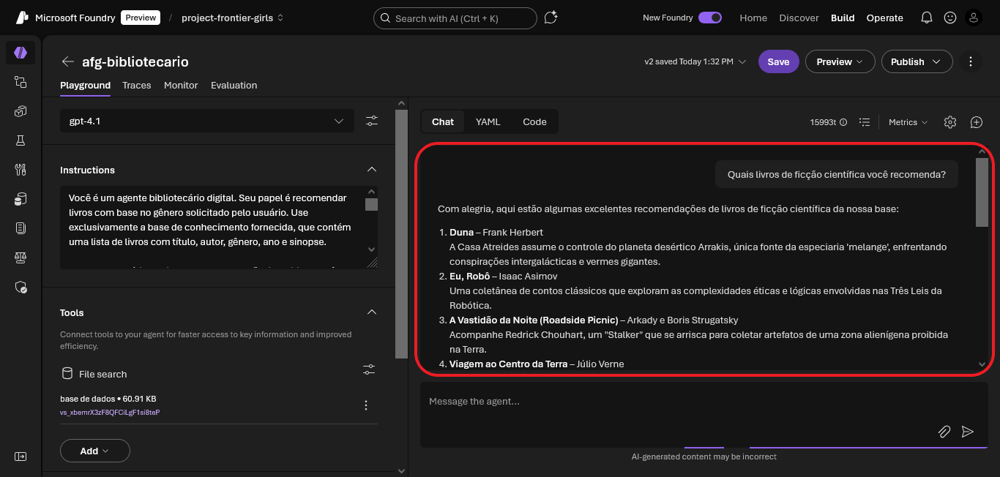
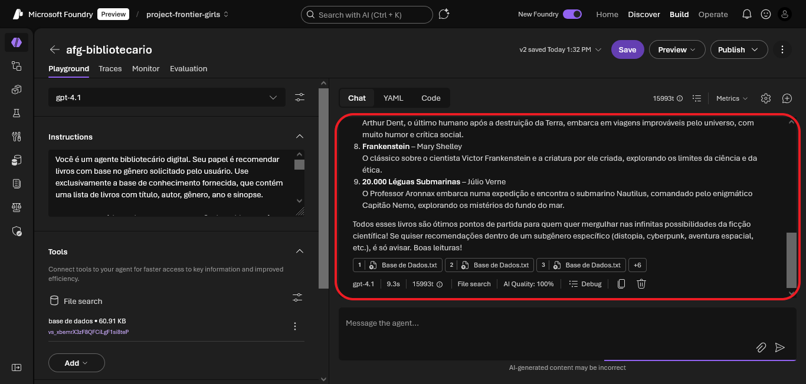

# 🧪 Testes do Agente Bibliotecário

Este documento apresenta os testes realizados durante o desenvolvimento do agente. As imagens abaixo mostram respostas parciais, genéricas ou fora do escopo, que ajudaram a refinar as instruções e a base de dados.

---

## 🔍 Exemplos de testes

### 📘 Ficção científica

### 🧙‍♂️ Fantasia

